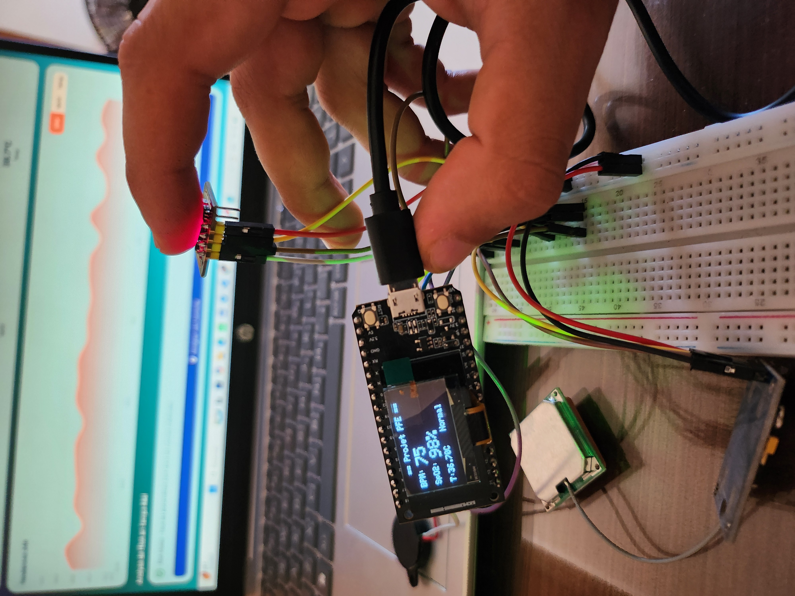
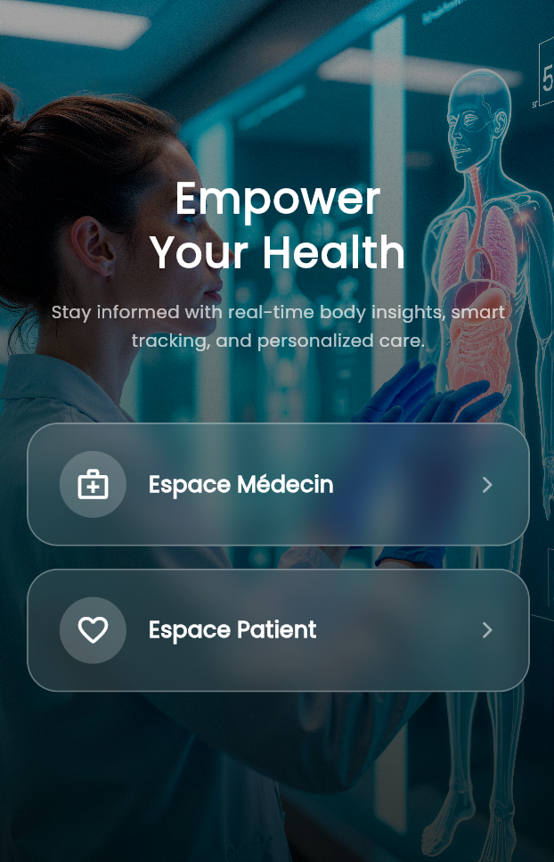
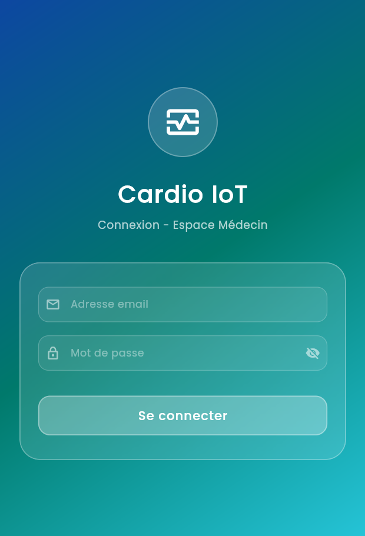
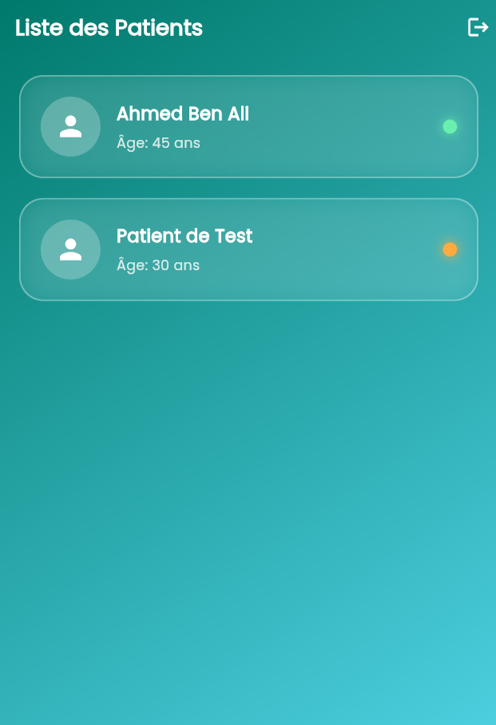
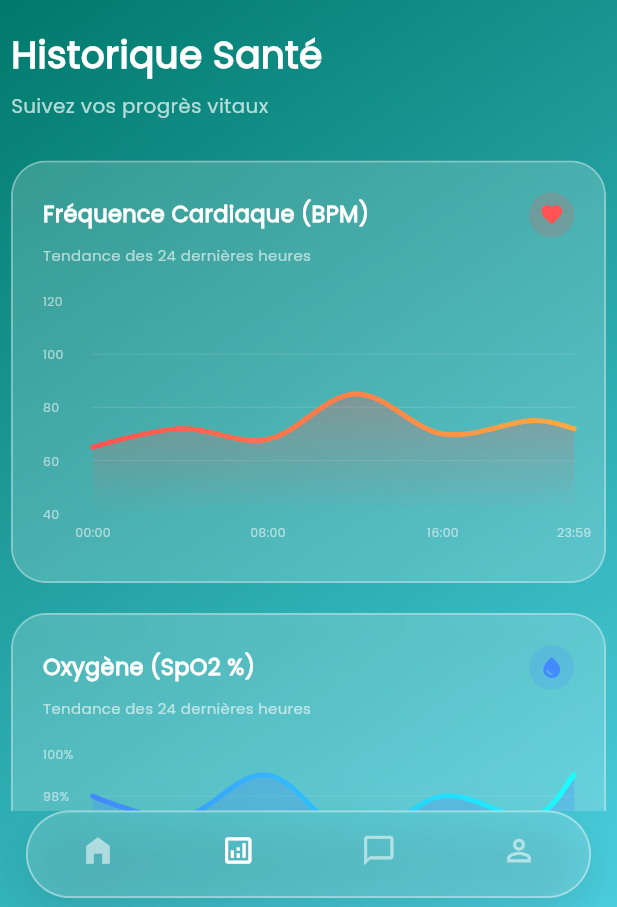
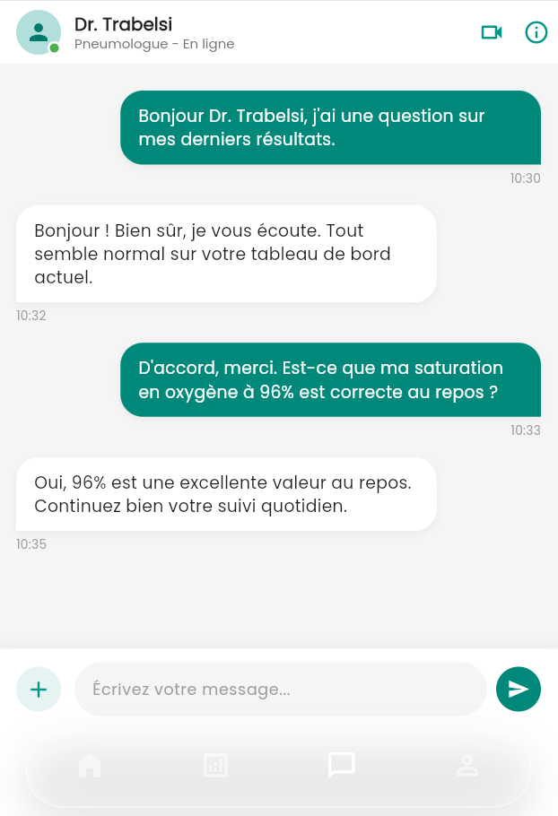
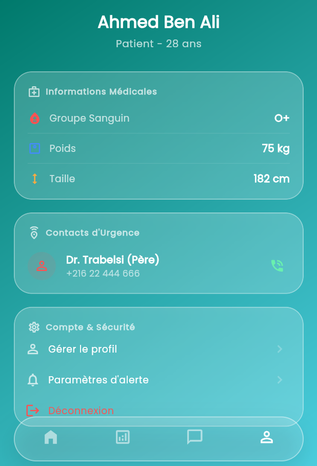
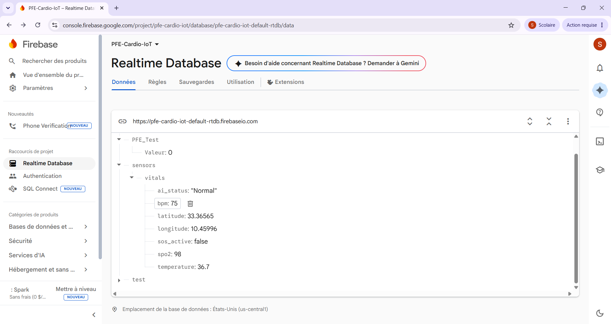

# 🫀 IoT Cardio Edge AI

**Dispositif IoT portable à base d'Edge AI pour la détection précoce des anomalies cardiorespiratoires**

Projet de fin d'études — Diplôme d'Ingénieur en Systèmes Embarqués et IoT
Institut Supérieur d'Informatique et de Multimédia de Gabès (ISIMG) — 2025/2026

---

## 📌 Contexte

Les maladies cardiovasculaires représentent la première cause de mortalité mondiale, avec 17,9 millions de décès par an selon l'OMS. Ce projet propose une alternative accessible aux solutions existantes (Apple Watch, Holter ECG) : un dispositif portable à faible coût, capable d'effectuer une **inférence IA directement sur microcontrôleur**, sans dépendance au cloud ni à une connexion internet permanente.

## 🏗️ Architecture globale

Le système repose sur une architecture à **trois couches interconnectées** :

| Couche | Rôle | Technologies |
|---|---|---|
| **Edge (Matérielle)** | Acquisition des paramètres vitaux et inférence IA locale | ESP32 TTGO LoRa32, MAX30102, MLX90614, GPS, TensorFlow Lite Micro |
| **Cloud (Backend)** | Stockage temps réel, authentification, notifications | Firebase Realtime Database, Firebase Auth, Firebase Cloud Messaging |
| **Mobile (Frontend)** | Visualisation, alertes, communication médecin-patient | Flutter (Android/iOS) |

Le dispositif embarqué mesure en continu la **fréquence cardiaque**, la **saturation en oxygène (SpO2)** et la **température corporelle**, exécute une inférence IA en moins de 100 ms, puis transmet les résultats en temps réel vers une application mobile offrant un espace dédié au patient et un espace dédié au médecin (monitoring multi-patients, navigation GPS d'urgence, chat intégré).

## 🧠 Méthodologie IA — Entraînement et sélection du meilleur modèle

Deux architectures de réseaux de neurones ont été entraînées et comparées rigoureusement afin d'identifier la configuration optimale pour un déploiement embarqué :

- **MLP (Multilayer Perceptron)** — réseau feedforward (64 → 32 → 16 → 1)
- **LSTM (Long Short-Term Memory)** — réseau récurrent (32 → 16 → 8 → 1)

**Données utilisées :**
- **Entraînement** : 973 411 mesures physiologiques réelles issues de VitalDB (99 patients en soins intensifs)
- **Test** : 12 634 cas cliniques indépendants (2 hôpitaux distincts) issus du PhysioNet Sepsis Challenge 2019

**Pipeline de prétraitement :**
1. Découpage en fenêtres glissantes temporelles (10 mesures consécutives)
2. Extraction de 12 features statistiques (mean, std, min, max sur FC, SpO2, température)
3. Labélisation basée sur des seuils cliniques (bradycardie/tachycardie, hypoxémie, hypo/hyperthermie)
4. Équilibrage des classes avec SMOTE (149 662 fenêtres équilibrées)
5. Normalisation StandardScaler

**Résultats comparatifs (Sepsis SetA) :**

| Métrique | MLP | LSTM |
|---|---|---|
| Accuracy | 86% | 93% |
| Sensitivity (Recall) | 89% | 95% |
| AUC-ROC | 0.933 | 0.978 |
| Taille du modèle (INT8) | **15 KB** | 36 KB |
| Latence d'inférence ESP32 | **< 100 ms** | ~500 ms |
| Compatible ESP32 (1.3 MB Flash) | ✅ Oui | ❌ Non (105% Flash utilisée) |

**Modèle retenu : MLP.** Bien que le LSTM affiche de meilleures performances théoriques, il s'est révélé incompatible avec les contraintes mémoire du microcontrôleur — TensorFlow Lite Micro ne supportant pas nativement les couches LSTM sur ESP32 (la bibliothèque `SELECT_TF_OPS` obligatoire occupe à elle seule ~1000 KB). Le MLP offre le meilleur compromis performance/déploiement : 86% d'accuracy, 89% de sensitivity, une empreinte de seulement 15 KB, et une latence compatible avec la détection médicale temps réel.

## 🔒 Fiabilité — Protection "Last Known Good Value"

Une stratégie de sécurité dédiée empêche les fausses alertes lorsque le capteur perd le contact (doigt retiré) : la dernière valeur physiologique valide est conservée et transmise, évitant toute lecture aberrante (ex. "0 BPM") côté médecin.

## 📱 Application mobile

Développée avec **Flutter** (Android/iOS), l'application propose deux espaces distincts :
- **Espace Patient** : constantes vitales en temps réel, historique 24h, chat avec le médecin, bouton SOS
- **Espace Médecin** : supervision multi-patients, tableaux de bord, navigation GPS d'urgence, notifications push

## 🛠️ Stack technique

**Embarqué :** ESP32 TTGO LoRa32, MAX30102, MLX90614, C++ (Arduino), TensorFlow Lite Micro
**IA / Data Science :** Python, TensorFlow/Keras, SMOTE, StandardScaler, Jupyter Notebook, Google Colab
**Backend :** Firebase (Realtime Database, Authentication, Cloud Messaging)
**Mobile :** Flutter, Dart

## 📂 Structure du dépôt# iot-cardio-edge-ai
Dispositif IoT portable à base d'Edge AI pour la détection précoce d'anomalies cardiorespiratoires
## 📸 Aperçu du prototype et de l'application

### Prototype matériel assemblé

### Application mobile — Écrans principaux

| Écran d'accueil | Connexion | Dashboard Patient |
|---|---|---|
|  |  |  |

| Dashboard Médecin | Liste des patients | Historique santé |
|---|---|---|
|  |  |  |

| Chat Patient/Médecin | Profil patient |
|---|---|
|  |  |

### Transmission temps réel — Firebase

